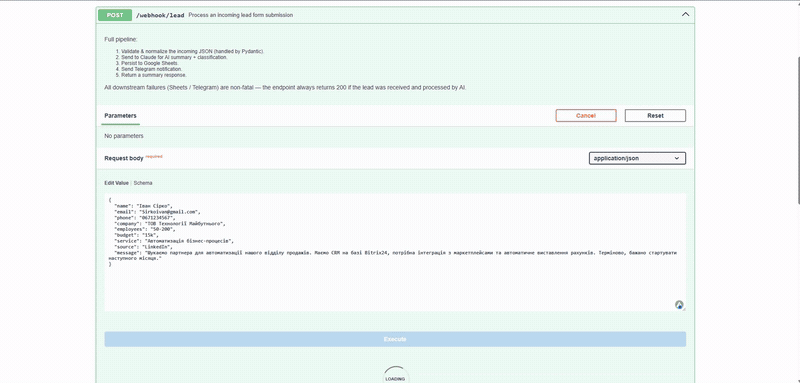

# Lead Processor

FastAPI-сервіс, який приймає заявку з лендінгу вебхуком і за кілька секунд
віддає менеджеру щось, з чим уже можна працювати: нормалізовані контакти,
згенероване AI резюме заявки та оцінку ліда — 🔥 HOT / 🟡 WARM / ❄️ COLD.
Результат паралельно лягає в Airtable і прилітає в Telegram.



*Запит іде через `POST /webhook/lead`, бот присилає картку ліда, і той самий
запис зʼявляється рядком у таблиці Airtable. Список чатів у записі навмисно
розмито.*

---

## Що відбувається із заявкою

```
POST /webhook/lead
       │
       ▼
┌─────────────────────┐
│  Валідація та       │  Pydantic: імʼя, email, телефон,
│  нормалізація       │  бюджет, джерело
└──────────┬──────────┘
           │
           ▼
┌─────────────────────┐
│   AI-аналіз         │  Groq · llama-3.3-70b-versatile
│                     │  резюме + HOT / WARM / COLD + причина
└──────────┬──────────┘
           │
     ┌─────┴─────┐   (паралельно, asyncio.gather)
     ▼           ▼
┌──────────┐ ┌──────────┐
│ Airtable │ │ Telegram │
└──────────┘ └──────────┘
```

Стек: **FastAPI + Pydantic v2**, **Groq** (`llama-3.3-70b-versatile`),
**Airtable REST API v0**, **Telegram Bot API**. Усі зовнішні виклики — через
`httpx`, без SDK.

---

## Три рішення, які тут варто пояснити

**Усе після AI-кроку не є фатальним.** Якщо Airtable або Telegram недоступні,
ендпоінт усе одно повертає `200`, а поле `destinations` показує, куди саме
дійшло. Логіка проста: заявку вже прийнято й оброблено, і втратити її через
збій нотифікації — гірша поразка, ніж тихо не надіслати повідомлення. Помилки
пишуться в лог, лід не губиться.

**Airtable і Telegram ідуть паралельно** через `asyncio.gather(...,
return_exceptions=True)` — послідовно це були б дві мережеві затримки одна за
одною на кожній заявці.

**Класифікація має rule-based запасний шлях.** Якщо `GROQ_API_KEY` не заданий
або виклик впав, `_fallback_analysis()` рахує простий скор за наявністю
бюджету, компанії, телефону й довжини повідомлення. Оцінка грубіша, але заявка
все одно доїжджає розміченою, а не падає в помилку.

---

## Запуск

```bash
python -m venv .venv
.venv/Scripts/activate          # Linux/macOS: source .venv/bin/activate
pip install -r requirements.txt

cp .env.example .env            # заповнити ключі
python main.py                  # http://localhost:8000
```

Інтерактивна документація — `http://localhost:8000/docs`.

### Змінні оточення

| Змінна | Обовʼязкова | Навіщо |
|---|---|---|
| `GROQ_API_KEY` | ні¹ | Ключ [Groq](https://console.groq.com/keys) — безкоштовно, 14 400 запитів/добу, без картки |
| `AIRTABLE_API_TOKEN` | ні² | Personal Access Token, [створити](https://airtable.com/create/tokens) зі скоупом `data.records:write` |
| `AIRTABLE_BASE_ID` | ні² | ID бази, вигляду `appXXXXXXXXXXXXXX` |
| `AIRTABLE_TABLE_ID` | ні² | ID таблиці, `tblXXXXXXXXXXXXXX`, або її назва |
| `TELEGRAM_BOT_TOKEN` | ні² | Токен від [@BotFather](https://t.me/BotFather) |
| `TELEGRAM_CHAT_ID` | ні² | ID чату або каналу (для каналу починається з `-100`) |
| `PORT` | ні | Порт сервера, дефолт `8000` |

¹ Без ключа сервіс не падає — вмикається rule-based класифікація.
² Без цих змінних відповідний крок просто пропускається з попередженням у логу.

Таблиця в Airtable має містити колонки: `Lead ID`, `Received At`, `Name`,
`Email`, `Phone`, `Company`, `Employees`, `Budget`, `Service`, `Source`,
`Message`, `Classification`, `Classification Reason`, `AI Summary`.

Ключі беруться тільки з `.env` / оточення і в репозиторій не потрапляють.

---

## Ендпоінти

| Метод | Шлях | Що робить |
|---|---|---|
| `POST` | `/webhook/lead` | Обробити заявку |
| `GET` | `/health` | Liveness-перевірка, `{"status": "ok"}` |
| `GET` | `/docs` | Swagger UI |

### Перевірка

```bash
curl -X POST http://localhost:8000/webhook/lead \
  -H "Content-Type: application/json" \
  -d @test_payload.json
```

### Приклад відповіді

```json
{
  "success": true,
  "lead_id": "A1401D91",
  "received_at": "2026-06-11 10:48 UTC",
  "classification": "🔥 HOT",
  "ai_summary": "Іван Сірко з ТОВ Технології Майбутнього (50-200 employees) шукає партнера для автоматизації відділу продажів. Потрібна інтеграція Bitrix24 з маркетплейсами та автоматичне виставлення рахунків. Бюджет 15000, старт наступного місяця.",
  "destinations": {
    "airtable": true,
    "telegram": true
  }
}
```

---

## Нормалізація

Форми присилають те, що набрала людина. `models.py` приводить це до ладу
до того, як дані підуть далі:

| Поле | Вхід | Після нормалізації |
|---|---|---|
| `name` | `"  іванов петро  "` | `"Іванов Петро"` |
| `email` | `"Petro@EXAMPLE.COM"` | `"petro@example.com"` |
| `phone` | `"(067) 123-45-67"` | `"+380671234567"` |
| `budget` | `"15k"`, `"$5,000"`, `"до 10 000 грн"` | `"15000"`, `"5000"`, `"10000"` |
| `source` | `"LinkedIn"`, `"friend"` | `"social"`, `"referral"` |

Телефон із 10 цифр, що починається з `0`, вважається українським і
розгортається у `+380…`. Бюджет, який не вдалося звести до числа, лишається
як є — краще передати менеджеру сирий рядок, ніж вигадану цифру.

## Класифікація

| Оцінка | Критерії |
|---|---|
| 🔥 **HOT** | Великий бюджет, компанія, конкретний запит, терміновість |
| 🟡 **WARM** | Є сигнали зацікавленості, але дані неповні |
| ❄️ **COLD** | Немає бюджету, нечіткий запит, ймовірно студент або дослідник |

Модель відповідає JSON-ом із трьох полів (`summary`, `classification`,
`reason`); markdown-огорожі, якщо вони таки зʼявляються, зрізаються перед
`json.loads`.

---

## Обмеження

Це MVP, і ось що в ньому свідомо не закрито:

- **Вебхук не автентифікований.** Хто знає URL — може слати заявки. Для
  продакшену потрібен спільний секрет у заголовку або підпис від форми.
- **Немає тестів.** Найкорисніші були б на нормалізацію в `models.py` —
  вона суто детермінована і мокати нічого не треба.
- **Немає ретраїв і черги.** Якщо Airtable віддав 500, запис просто губиться:
  в лог він потрапляє, але ніхто його не перепроведе. Наступний крок —
  складати невдалі записи в чергу і повторювати.
- **Валюта бюджету втрачається.** `"$5,000"` і `"5000 грн"` обидва стають
  `"5000"`. Поки всі заявки в одній валюті це не заважає, далі — заважатиме.
- **`lead_id` — це `uuid4[:8]`.** 8 hex-символів; на десятках тисяч заявок
  колізія стає реальною.

---

## Структура

```
main.py             FastAPI-застосунок, ендпоінти, оркестрація пайплайна
models.py           Pydantic: LeadRequest (нормалізація) + ProcessedLead
ai_service.py       Groq: промпт, парсинг JSON, rule-based фолбек
airtable.py         Запис рядка в Airtable через REST API
telegram.py         Форматування й надсилання HTML-повідомлення в Telegram
test_payload.json   Приклад заявки для перевірки
docs/demo.gif       Запис роботи сервісу
```

## Деплой

Образу тут немає — це звичайний ASGI-застосунок, який стартує через
`uvicorn main:app`. Порт читається зі змінної `PORT`, тож він підходить
платформам, які підставляють її самі (Render, Railway, Fly.io). Python-версія
зафіксована в `runtime.txt` і `.python-version` — 3.11.9.

Секрети задаються змінними оточення на боці платформи, а не файлом `.env`.
